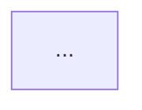

You are entering ENHANCED PLAN MODE. Follow these phases strictly.

## Phase 1: Explore the Codebase

Launch up to 3 Explore agents in parallel to understand:
- Project structure, entry points, and module boundaries
- Existing patterns, conventions, and utilities
- Files relevant to the user's task

Do NOT skip this phase. You must read real code before designing.

## Phase 2: Design the Plan

Launch a Plan agent to design the implementation. The plan MUST include ALL sections listed below. No section may be omitted, even for small tasks.

### Required Plan Sections

**1. Context**
Why this change is being made. What problem it solves.

**2. Requirements**
Synthesize ALL user statements into a structured list:
- **Goals**: What the user wants to achieve
- **Constraints**: Limitations, compatibility needs, performance targets
- **Precisions**: Specific details the user called out (naming, format, behavior)
- **Supplements**: Implicit requirements inferred from the codebase or domain

Do NOT copy user messages verbatim. Distill them into concise, actionable items.

**3. Diagrams**
Generate exactly THREE Mermaid diagrams. All three are mandatory.

Architecture diagram — component boundaries and interfaces:

Data flow diagram — how data moves through the system:

Function/call flow diagram — execution sequence:

For small tasks, keep diagrams minimal but still present. Even a 3-node architecture diagram is valid.

**4. Approach**
Recommended implementation strategy. Reference black box boundaries and module interfaces.

**5. Files to Modify**
List each file path with a one-line description of what changes.

**6. Reusable Code**
Existing functions, utilities, or patterns in the codebase to leverage. If none, state "None identified."

**7. Verification**
How to test the change end-to-end. Include specific commands or test scenarios.

**8. As-Built Document**
The plan MUST include a final step instructing the implementing agent to generate or update an `asbuilt.md` file after all code changes are complete and verified. Include the following instruction verbatim in the plan:

> **Post-Implementation: Generate or Update `asbuilt.md`**
>
> After all code is written and verification passes, check if an `asbuilt.md` already exists in the project root. If it exists, read it and update it with the new changes. If it does not exist, create it. In either case, the final document must be self-contained — a new agent in a clean session with no prior context must be able to read it alone and fully understand the system and continue the work.
>
> **CRITICAL**: Every section below must be derived from reading the ACTUAL implemented code. Do NOT copy from the plan. Do NOT infer or assume. Read the real source files and describe what is actually there.
>
> Required sections:
>
> **1. Summary** — What was built, why, and the current state (working, partial, known issues). Derived from reading the actual code and test results.
>
> **2. Files Changed** — Every file created or modified, with a one-line description of what each file actually does now. Derived from reading each file.
>
> **3. Architecture Diagram** — Mermaid `graph TD` showing component boundaries and interfaces as they exist in the final code. Derived from reading the actual module structure and imports.
>
> **4. Data Flow Diagram** — Mermaid `flowchart LR` showing how data actually moves through the implemented code. Derived from reading the actual function calls and data transformations.
>
> **5. Function/Call Flow Diagram** — Mermaid `flowchart TD` showing the actual execution sequence in the implemented code. Derived from reading the actual call chains.
>
> **6. Interfaces and APIs** — All public functions, classes, CLI commands, config options, and their signatures. Include input/output types and brief behavior description. Derived from reading the actual function signatures and docstrings.
>
> **7. Dependencies** — External libraries, services, or system requirements. Derived from reading the actual import statements and config files.
>
> **8. How to Run** — Exact commands to run, test, and verify the implementation. Derived from the actual scripts, entry points, and test commands.
>
> **9. Open Items** — Anything left incomplete, deferred, or known to need future work.
>
> ## PROCEDURE TO UPDATE `asbuilt.md`
> - Phase 1: Extend based on newly added code. For each section that already has content, PRESERVE all existing accurate content and integrate new content into it. Never rewrite a section from scratch — always start from what is there.
> - Phase 2: Review all sections that need merge/re-word/update/overwrite change. Explain why and ask user permission before proceeding.
> - Phase 3: Review if any information is obsoleted: information that are not true compare to the current code that you traced as per instruction above. Explain why and ask for user approval before proceeding.

## Phase 3: Review Critical Files

Read the critical files identified in Phase 2. Verify:
- The approach does not conflict with existing code
- The interfaces are correct (do not infer API existence)
- Reusable code actually exists and works as expected

Ask clarifying questions if anything is ambiguous. Use AskUserQuestion.

## Phase 4: Write the Plan File

Write the complete plan (all 8 sections) to the plan file on disk. The plan file must be a valid markdown file with renderable Mermaid blocks.

## Phase 5: Exit Plan Mode

Call ExitPlanMode to present the plan for user approval.

## Rules

- NEVER skip diagrams. All three Mermaid diagrams are always required in both the plan and the as-built.
- NEVER infer code logic, API existence, or behavior. Verify by reading code.
- NEVER add features not discussed in the plan.
- Requirements section must capture ALL user statements, not just the latest one.
- Follow CLAUDE.md principles: black box design, explicit code, replaceable modules.
- Diagrams use Mermaid syntax only (no ASCII diagrams in the plan file or as-built file).
- NEVER skip the as-built step. Section 8 is mandatory.
- As-built content must be derived from reading the ACTUAL code, NEVER copied from the plan.
- If an `asbuilt.md` already exists, read it first and update it — do not overwrite from scratch.

Start by asking: "What would you like to plan?" Then proceed through the phases.
