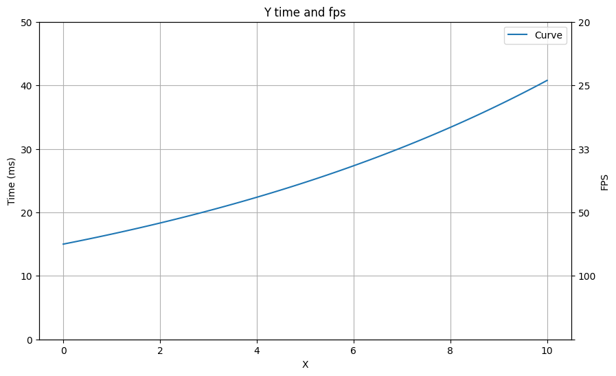

### Double y-axis Time and FPS
```python
import matplotlib.pyplot as plt
import numpy as np

x = np.linspace(0, 10, 100)  # X values from 0 to 10
y = np.exp(x / 10) * 15      # Positive curve with y ranging from ~5 to ~50

plt.figure(figsize=(10, 6))
plt.plot(x, y, label='Curve')
plt.xlabel('X')
plt.ylabel('Time (ms)')
plt.title('Y time and fps')

plt.ylim(0, 50)
plt.grid()
plt.legend()

# FPS axis
ax2 = plt.gca().twinx()
ax2.set_ylabel('FPS')

ax2.set_ylim(0,50)

tick_positions = ax2.get_yticks()
tick_labels = ax2.get_yticklabels()
labels = [float(label.get_text()) for label in tick_labels]
relabels = []
for label in labels:
    if label == 0:
        relabels.append("")
    else:
        relabels.append(f"{1000/label:.0f}")
ax2.set_yticks(tick_positions,relabels)

# Important: set tick will change the ylim in order to display everything and mess up with the position.
# Reset the ylim to the original value
ax2.set_ylim(0,50)

plt.show()
```


### Hieu confusion matrix
```python
def plot_hieu_confusion_matrix(gt, predicted, class_names, title=None):
    from sklearn.metrics import confusion_matrix
    import matplotlib.pyplot as plt
    import seaborn as sns
    import numpy as np

    cm = confusion_matrix(gt, predicted)

    cmmod = np.copy(cm)
    np.fill_diagonal(cmmod, 0)
    maxval = np.max(cmmod)
    sns.heatmap(cmmod, annot=False, fmt='d', cmap='Blues', xticklabels=class_names, yticklabels=class_names)
    plt.xticks(rotation=40, ha='right')

    # Adjust text color for masked cells
    for i in range(cm.shape[0]):
        for j in range(cm.shape[1]):
            if cm[i, j] == 0:
                plt.text(j + 0.5, i + 0.5, '-', ha='center', va='center', color='black')
            else:
                if cm[i, j] < maxval / 3 or i == j:
                    color = 'black'
                else:
                    color = 'white'
                plt.text(j + 0.5, i + 0.5, cm[i, j], ha='center', va='center', color=color)

    plt.xlabel('Predicted')
    plt.ylabel('Human label')
    if title is None:
        plt.title('Hieu Confusion Matrix')
    else:
        plt.title(title)
```

### Custom legend color bar
```python
def colorBar(mini=0, maxi=1,
             nColor=100,
             nLabel=4,
             aspect=0.03,
             colorMap="plasma"):
    step=(maxi-mini)/nColor
    m = np.zeros((1,nColor+1))
    for i in range(nColor+1):
        m[0,i] = mini + (i*step)

    plt.imshow(m, cmap=colorMap, aspect=aspect*(maxi-mini),extent=(min(m[0])-0.5*step,max(m[0])+0.5*step,0,1))
    plt.yticks(np.arange(0))
    plt.xticks(np.arange(mini,maxi*1.1,(maxi-mini)/(nLabel+1)))
    plt.show()
```

### Get color from value
```python
cmap = matplotlib.cm.get_cmap('viridis')
norm = matplotlib.colors.Normalize(vmin=0, vmax=MY_MAX)
rgba=cmap(norm(MYVALUE))
```


### Chage figure size
One of:
```python
plt.plot(blalba)
plt.gcf().set_size_inches(15, 15)
```
Set the default figure size:
```python
plt.rcParams["figure.figsize"] = (20,10)
plt.rcParams.update({'font.size': 14})
plt.rcParams['figure.facecolor'] = 'white'
```


### Subset date when there are duplicate date
```python
df['date'] = df.index
sub=df[df.date.between('2022-02-14 06:37','2022-02-15 06:37')]
```
You need to set a column because  `DateTimeIndex` do not have `between()` while `Timestamp` do.


### Default figure size and font
``` python
import matplotlib.pyplot as plt

plt.rcParams["figure.figsize"] = (20,10)
plt.rcParams.update({'font.size': 14})
```


### Change tick frequency
``` python
from matplotlib.ticker import (MultipleLocator, AutoMinorLocator)

plt.gca().yaxis.set_minor_locator(MultipleLocator(0.1))
plt.grid()
plt.grid(which="minor",alpha=0.2)
```

For dates:
``` python
import matplotlib.dates as mdates

plt.gca().yaxis.set_minor_locator(mdates.DayLocator(interval=5))
plt.grid()
plt.grid(which="minor",alpha=0.2)
```
See https://www.earthdatascience.org/courses/use-data-open-source-python/use-time-series-data-in-python/date-time-types-in-pandas-python/customize-dates-matplotlib-plots-python/

### Manual ticking
```python
plt.gca().set_xticks(tickLocationArray)
plt.gca().set_xticklabels(labelArray)
```

### Rotate xlabel
For dates:
```python
plt.gcf().autofmt_xdate()
```

For non-date one:
```python
plt.xticks(rotation=30)
```


### Change the date format on axis
```python
from matplotlib.dates import DateFormatter

plt.gca().xaxis.set_major_formatter(DateFormatter("%b-%d"))
```

### Get color array
```python
cmap = plt.get_cmap("tab10")
col0 = cmap(0)
```
See also: https://stackoverflow.com/questions/42086276/get-default-line-colour-cycle

Or use those name:  `C0`,`C1`,`C2`,...


### Get last line color
```python
lastCol = plt.gca().lines[-1].get_color()
```

### Legend at the end of line plot
```python

# Do all your plot with label in
# Store all your labels in array: labelList

ax=plt.gca()
for line, name in zip(ax.lines, labelList):
    y = line.get_ydata()[-1]
    x = line.get_xdata()[-1]
    text = ax.annotate(name,
                       xy=(x, y),
                       xytext=(0, 0),
                       color=line.get_color(),
                       textcoords="offset points")
```


### Multi plot
```python
fig=plt.figure(figsize=(20,18))  # Optional: define figure size
ax1 = plt.subplot(211)  # in a 2 rows, 1 cols setup, figure 1, : we call it ax1
ax2 = plt.subplot(212)  # in a 2 rows, 1 cols setup, figure 2, : we call it ax2

plt.sca(ax1)  # We now plot on to ax1
plt.plot(....)
plt.legend( ...)

plt.sca(ax2)  # We now plot on to ax2
plt.scatter(...)

plt.subplots_adjust(wspace=0.5, hspace=0) # For tightening space between plot

plt.show()
```

### Merge row subplot
This give merge first row and have 2 columns plot in second row.
```python
ax1 = plt.subplot(211)
ax2 = plt.subplot(223)
ax3 = plt.subplot(224)
```

### Shaded density plot
Require sns

```python
import seaborn as sns
sns.kdeplot(l.spike,label = "chudleigh",
            fill=True,linewidth=3,
            clip=(0,4))

sns.kdeplot(c.spike,label = "crv",
            fill=True,linewidth=3,
            clip=(0,4))

# DECAPRECATED
#sns.distplot(l.spike, hist = False, kde = True,
#                 kde_kws = {'shade': True, 'linewidth': 3},
#                  label = "chudleigh")
#sns.distplot(c.spike, hist = False, kde = True,
#                 kde_kws = {'shade': True, 'linewidth': 3},
#                  label = "crv")

```
`displot`, the replacement of `distplot`, is actually just a wrapper around 3 functions. It's a one-line plot that suppose to do everything. You can not stack plot like with `plt`. You better just use directely the plot function behind it like `kdeplot`.
